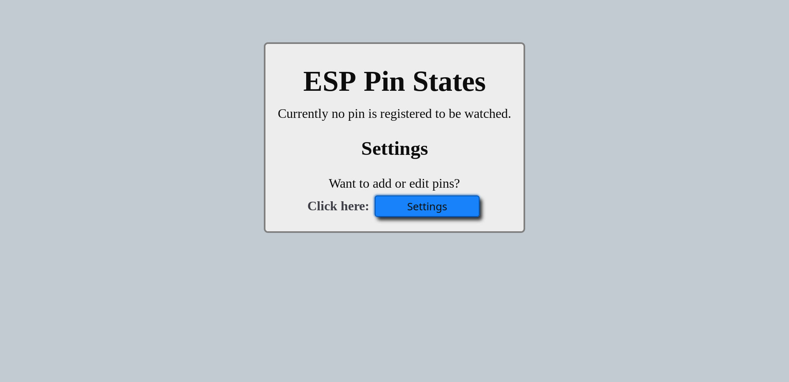
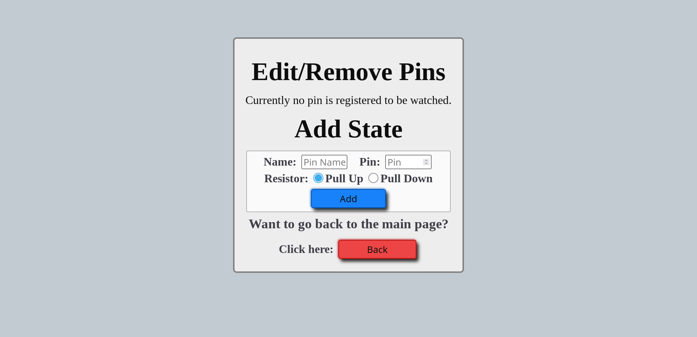
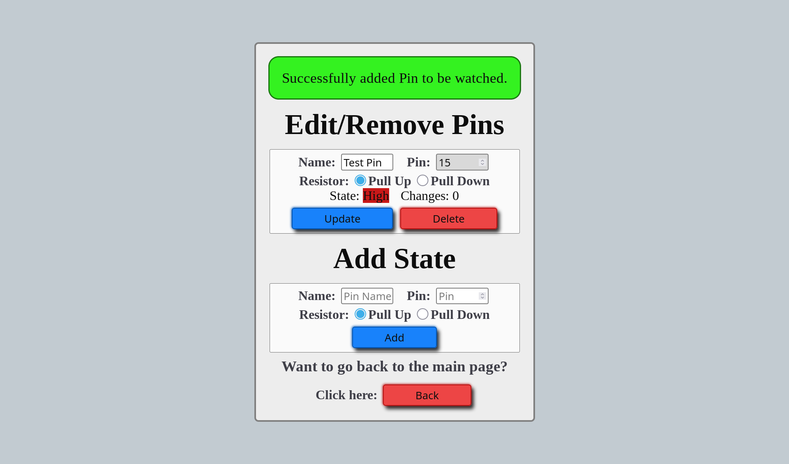
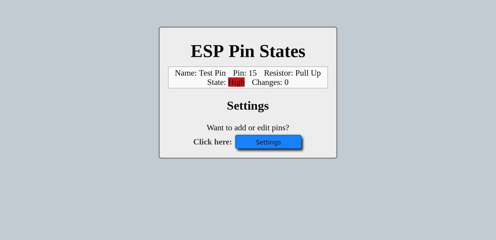
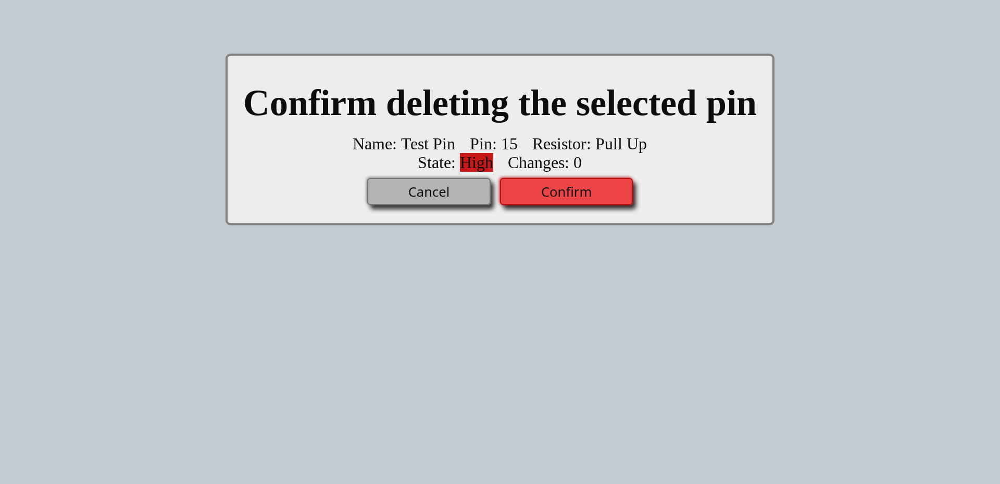
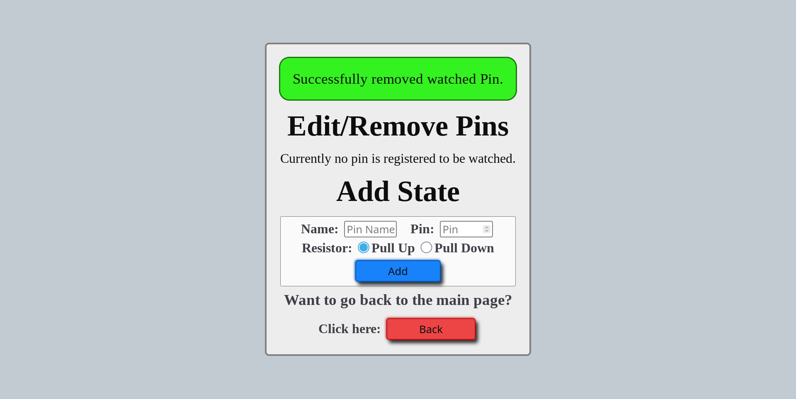
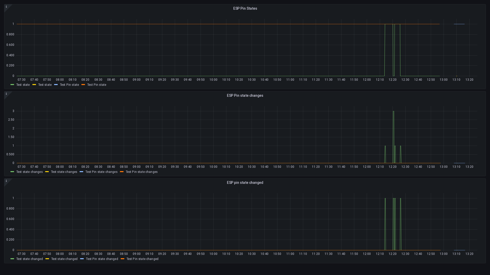

# ESP-WiFi-GPIO-Monitor
This ESP32 program monitors the state of a dynamic set of GPI/GPIO pins, and reports their state on a web interface.  
It also contains a metrics endpoint for [prometheus](https://prometheus.io/).

## Requirements
 * A supported microcontroller
 * A supported temperature sensor
 * The Pull Up Resistor for said sensor
 * USB-Micro-B to USB-A cable
 * A PC with a working [platformio](https://platformio.org/) installation

## Installation
Follow these steps to build this software and install it on an ESP32.
 * Create a wifissid.txt file containing the name of your WiFi network in this projects root directory.  
   Make sure this file and the next two don't end with a space or empty line.
 * Create a wifipass.txt file containing the passphrase for said WiFi network next to it.
 * Create a otapass.txt file containing the password to be used to update this project over WiFi.  
   Changing this file means you need to upload the project using an USB cable again.
 * Optionally set a static IP for the ESP32 in config.h by changing `STATIC_IP` and `GATEWAY_IP`.
 * Connect your ESP32 to your PC using a USB-A to USB-Micro-B cable.
 * Build this project and flash it to the ESP by running `pio run -t upload -e esp32dev`.  
   This uploads the software using the USB cable, to later update over WiFi run `pio run -t upload -e esp32dev_ota`.

## Getting Started
Follow these steps after finishing the installation to start watching pins.
 * Connect whatever you want to watch to a GPI or GPIO pin.
 * Open [esp-wifi-gpio-monitor.local](http://esp-wifi-gpio-monitor.local/) in a browser.  
   The page should look like this:  
   
 * Click on the blue `Settings` button at the bottom.  
   The page should now look like this:  
   
 * Enter the pin you want to watch(A number from 0 to 39) in the right input under `Add State`.
 * Give your pin a name.  
   This name can be 3-32 characters long, and can contain letters, digits, spaces, hyphens, and underscores.  
   This name can be changed later, and is shown on the web interface.  
   This name is only for human identification.
 * Select whether you want to use an internal pull up or pull down resistor.  
   This controls in which state the pin is when it isn't connected to anything.
 * Click the blue `Add` button under the inputs you just used.  
   The page now looks like this:  
   
 * At the top you can change the name and resistor for your pin(s), or delete it/them.  
   At the bottom you can add more pins to be watched just like this.  
   As long as you do not update any of the input fields this page will automatically update its contents every 5 seconds.
 * Click on the red `Back` button at the bottom to get back to the index page intended to watch pin changes.  
   This page should like this now:  
   
 * When deleting a pin a confirmation page like this opens before actually deleting the pin:  
   
 * After this the settings page should look like this:  
   

# Support
This part of the README contains info on support for other software integrated in this.

## Prometheus
ESP-GPIO-Monitor contains a [prometheus](https://prometheus.io/) metrics endpoint on `/metics` port 80.  
To register this with your [prometheus](https://prometheus.io/) instance simply add a block like this to the `scrape_configs` section of your `prometheus.yml` and reload prometheus.

```yml
  - job_name: esp-wifi-gpio-monitor
    static_configs:
    - targets: ['ESP_IP:80']
```

## Grafana
This repository contains a [grafana](https://grafana.com/) dashboard to be used with the [promethes](https://prometheus.io/) integration.  
This dashboard looks like this:  


### Setup
 * Open your grafana instance and log in as a user with permissions to create new dashboards.
 * Hover over the "+" on the left side of the page.
 * Click "Import" in the dropdown that appears.
 * Either click on "Upload JSON file" and select the `grafana-dashboard.json` file in this project.  
   Or copy the contents of `grafana-dashboard.json`, paste them into the text field under "Import via panel json", and click "Load".
 * Click "Import" on the bottom of the page.
